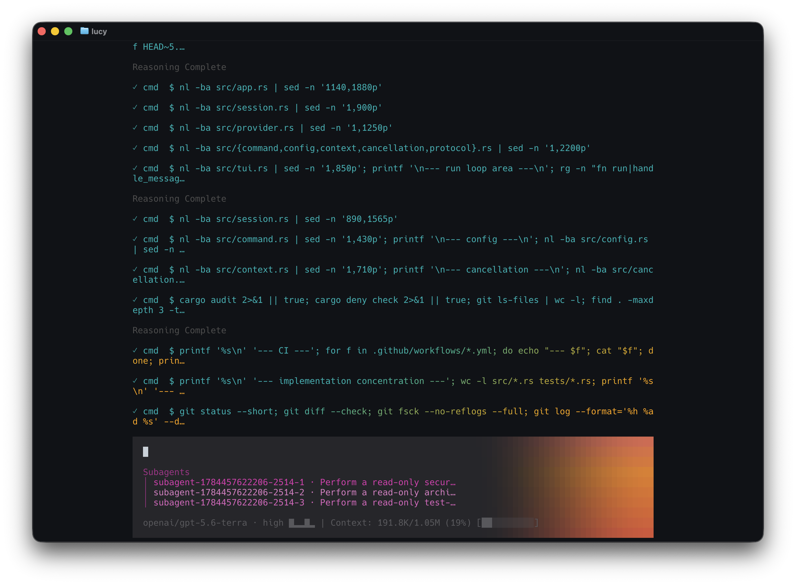

# Lucy



## Project purpose

Lucy is a lightweight local coding-agent harness for macOS and Linux. It connects one OpenAI-compatible Chat Completions provider and model-facing `cmd` and `spawn_subagent` tools, with both an interactive TUI and a JSONL interface for automation powered by the same turn engine.

## Installation

Prebuilt releases are available for Apple Silicon macOS, Intel macOS, and x86_64 Linux. The recommended installation method is Homebrew:

```sh
brew install jwoo0122/tap/lucy
```

The `lucy-cli` crate is also published on crates.io for Rust users:

```sh
cargo install lucy-cli
```

Prebuilt archives are available from the [GitHub Releases](https://github.com/jwoo0122/lucy/releases) page. After extracting the archive, place the `lucy` executable on your `PATH`.

On first run, Lucy creates `$XDG_CONFIG_HOME/lucy/config.toml` (or `~/.config/lucy/config.toml` when `XDG_CONFIG_HOME` is unset or empty). Existing `~/.lucy/config.toml` files are migrated once; sessions remain under `~/.lucy/sessions`. Set `llm.model` and the environment variable that holds the API key. OpenRouter is the default provider, but any OpenAI-compatible endpoint can be configured.

```toml
[llm]
base_url = "https://openrouter.ai/api/v1"
model = "your-model"
api_key_env = "OPENROUTER_API_KEY"
```

```sh
export OPENROUTER_API_KEY="..."
```

## Usage

Run Lucy in a terminal to start the TUI. Use the release binary path when building from source:

```sh
lucy
# Or: ./target/release/lucy
```

Lucy automatically uses JSONL mode when either standard input or output is not a terminal. Use `--tui` or `--jsonl` to choose a mode explicitly.

```sh
printf '%s\n' '{"type":"message","text":"Inspect the project."}' | lucy --jsonl
lucy --session <session-id>
lucy --list-sessions
```

In the TUI, press Enter to send, Shift/Alt+Enter to insert a line break, and Esc to cancel the active turn. Enter or Tab selects a focused skill in the slash picker; then enter `/<name> [args]` to attach the saved `SKILL.md` snapshot for that skill to the next model request. The same slash picker includes the Lucy-owned `/settings [ignored args]` and `/exit` commands.

## Features

- **TUI and JSONL:** Supports terminal chat and line-delimited JSON automation.
- **Streaming activity:** Shows model output, reasoning wait states, tool calls/results, and cancellation status in the TUI.
- **Tool activity UI:** Renders `cmd` as a compact one-line card and lists active background subagents between the message input and bottom status line with task id and a short task preview. Parent lifecycle-tool cards are suppressed: check/send briefly flash the targeted row, wait shows `Waiting for` with a spinner, and cancel shows `Cancelling` until the worker ends; failed or unknown targets remain transcript errors. Down from the last input row focuses the list; a focused worker exposes its live assistant/tool stream above the input. Terminal workers leave the list immediately; pending and delivered result transitions remain in the transcript. The main-agent ready/working indicator appears in the bottom status line, and the prompt border uses a left-to-right teal-to-green gradient.
- **Completion notifications:** When a TUI turn becomes idle, Lucy sends a terminal-native OSC 777 desktop notification for completion, cancellation, or error when the terminal supports it; JSONL output is unchanged.
- **Safe local command execution:** Runs trusted finite `cmd` shell commands from the session's starting directory with time and output limits.
- **Background sub-agents:** `spawn_subagent` immediately returns a queued task ID while up to four isolated workers run in parallel. The main agent should continue its own work without waiting; the logical main turn suspends when needed and resumes with a typed background result instead of fabricating a user message. Use `check_subagent` only for an intermediate or on-demand check, not repeated polling. Workers inherit the current session model and reasoning effort in addition to boot context and cwd; callers cannot override those settings. Workers may use `cmd` but cannot recursively delegate. The TUI shows running workers between the prompt and status line; Down focuses the list from the last input row, and a focused worker exposes its live stream above the prompt. The TUI accepts additional user messages while a turn is active and serializes them for processing. `wait_subagent`, `send_subagent`, and `cancel_subagent` provide lifecycle control. Each worker persists a secret-redacted child transcript linked to the parent session; completion results are injected before the next provider request at a safe tool boundary.
- **Persistent sessions:** Stores conversation history, provider settings, boot context, and skill snapshots as JSONL in `~/.lucy/sessions/` and supports resuming them.
- **Context and skills:** Collects global `$XDG_CONFIG_HOME/lucy/AGENTS.md` (or `~/.config/lucy/AGENTS.md`) plus project `AGENTS.md`/`CLAUDE.md` instructions and Agent Skills for new sessions. The model sees only skill metadata; explicit slash-prefixed skill-name invocations use the saved snapshot.
- **Automatic context compaction:** At 95% estimated context usage, safely summarizes older complete turns with the configured model, retains recent context, and resumes the active turn without rewriting session history.
- **Credential protection:** Reads API keys only from environment variables and prevents them from being written to configuration, sessions, the public protocol, or diagnostics.
