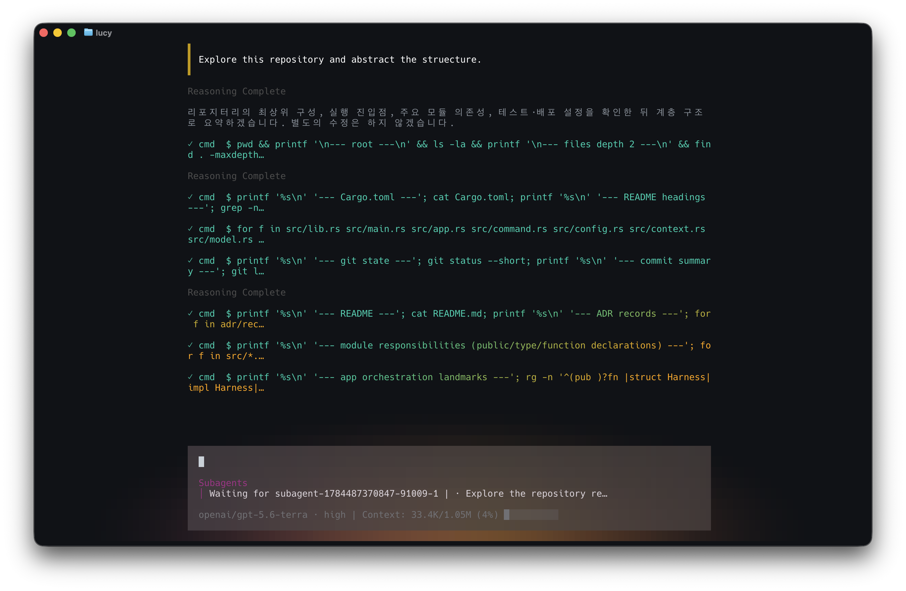

<p align="center">
  
</p>

<h1 align="center">Lucy</h1>

<p align="center">An ultra-thin harness for tomorrow's most powerful models</p>

<p align="center">
  
</p>



## Project purpose

Lucy is a lightweight local coding-agent harness for macOS and Linux. It connects an OpenAI-compatible Chat Completions provider or a Codex subscription provider and exposes a model-facing `cmd` tool, with both an interactive TUI and a JSONL session interface for automation powered by the same turn engine.

## Installation

Prebuilt releases are available for Apple Silicon macOS, Intel macOS, and x86_64 Linux. The recommended installation method is Homebrew:

```sh
brew install jwoo0122/tap/lucy
lucy setup
lucy
```

The `lucy-cli` crate is also published on crates.io for Rust users:

```sh
cargo install lucy-cli
```

Prebuilt archives are available from the [GitHub Releases](https://github.com/jwoo0122/lucy/releases) page. After extracting the archive, place the `lucy` executable on your `PATH`.

Run `lucy setup` in a terminal to choose an OpenAI-compatible API-key connection or a Codex subscription. Plain `lucy` starts the same setup flow before the TUI when configuration is incomplete. Setup stores only the API-key environment-variable name, never the key value. JSONL and other non-interactive invocations fail fast and direct you to `lucy setup` instead of prompting.

Lucy writes `$XDG_CONFIG_HOME/lucy/config.toml` (or `~/.config/lucy/config.toml` when `XDG_CONFIG_HOME` is unset or empty). Existing `~/.lucy/config.toml` files are migrated once; sessions remain under `~/.lucy/sessions`. Re-running setup updates Lucy-owned connection fields while preserving unrelated valid TOML content. Existing configs without `[auth]` continue to use legacy OpenRouter-compatible settings.

### Manual configuration (advanced/reference)

Lucy’s system guidance is built into the binary and is not configurable. New configs omit the former top-level `system_prompt`; an existing valid key is accepted, ignored, and preserved during settings updates. Loading, bootstrapping, and migration do not rewrite an existing config. Built-in guidance changes apply to new sessions, while resumed sessions retain their saved boot prompt.

```toml
[auth]
provider = "openrouter"
api_key_env = "OPENROUTER_API_KEY"

[llm]
base_url = "https://openrouter.ai/api/v1"
model = "your-model"
```

```sh
export OPENROUTER_API_KEY="..."
```

When `llm.base_url` uses the `openrouter.ai` host, Lucy adds OpenRouter's ephemeral prompt-cache directive to every Chat Completions request, including compaction summaries. Other OpenAI-compatible endpoints receive no cache directive. This enables provider-side prompt caching only; Lucy does not enable response caching.

To use a ChatGPT plan through Codex, log in separately. Tokens are stored in Lucy's private credential store, not in `config.toml` or sessions:

```sh
lucy codex login
# ... use a Codex model in config.toml ...
lucy codex logout
```

Use this configuration for Codex:

```toml
[auth]
provider = "codex_subscription"

[llm]
model = "gpt-5.3-codex"
```

## Troubleshooting

Run static configuration, storage, authentication, provider-metadata, shell, terminal, and protocol checks without creating a conversation session:

```sh
lucy doctor
lucy doctor --json
```

Use `lucy doctor --live` only when you explicitly want one bounded provider streaming request that may incur provider cost. It validates Lucy's `cmd` request schema but never executes a model-selected command. JSON reports are secret-redacted and suitable for issue filing:

```json
{"version":1,"ok":true,"checks":[{"id":"config.toml","status":"pass","message":"configuration TOML is valid"}]}
```

## Usage

Run Lucy in a terminal to start the TUI. Use the release binary path when building from source:

```sh
lucy
# Or: ./target/release/lucy
```

Lucy automatically uses JSONL mode when either standard input or output is not a terminal. Use `--tui` or `--jsonl` to choose a mode explicitly.

```sh
printf '%s\n' '{"type":"message","text":"Inspect the project."}' | lucy --jsonl
lucy --session <session-id>
lucy --list-sessions
```

In the TUI, press Enter to send, Shift/Alt+Enter to insert a line break, and Esc to cancel the active turn. Enter or Tab selects a focused skill in the slash picker; then enter `/<name> [args]` to attach the saved `SKILL.md` snapshot for that skill to the next model request. The same slash picker includes the Lucy-owned `/settings [ignored args]`, `/session`, and `/exit` commands.

## Features

- **TUI and JSONL:** Supports terminal chat and line-delimited JSON automation.
- **Streaming activity:** Shows model output, reasoning wait states, tool calls/results, and cancellation status in the TUI.
- **Tool activity UI:** Renders `cmd` as a compact one-line card. The main-agent ready/working indicator appears in the bottom status line, and the prompt border uses a left-to-right teal-to-green gradient.
- **Completion notifications:** When a TUI turn becomes idle, Lucy sends a terminal-native OSC 777 desktop notification for completion, cancellation, or error when the terminal supports it; JSONL output is unchanged.
- **Safe local command execution:** Runs trusted `cmd` shell commands from the session's starting directory with time and output limits. Commands may set `background: true` to return a background ID immediately; Lucy delivers the bounded completion result to the model automatically, including through a follow-up turn after the originating turn ends.
- **Agent process boundary:** Other agents can invoke `lucy --jsonl` through `cmd`, capture the returned `session_id`, and continue the conversation with `lucy --jsonl --session <id>`. Lucy does not coordinate relationships between independent sessions.
- **Persistent sessions:** Stores conversation history, provider settings, boot context, and skill snapshots as JSONL in `~/.lucy/sessions/` and supports resuming them.
- **Context and skills:** Composes built-in guidance with the working directory, README files, global `$XDG_CONFIG_HOME/lucy/AGENTS.md` (or `~/.config/lucy/AGENTS.md`), project `AGENTS.md`/`CLAUDE.md`, and Agent Skills for new sessions. The model sees only skill metadata; explicit slash-prefixed skill-name invocations use the saved snapshot.
- **Automatic context compaction:** At 95% estimated context usage, safely summarizes older complete turns with the configured model, retains recent context, and resumes the active turn without rewriting session history.
- **Credential protection:** OpenRouter API keys are read only from environment variables and are not written to configuration, sessions, the public protocol, or diagnostics. Codex subscription tokens are stored in Lucy's private credential store and are never exposed to model tools or persisted sessions. The active provider credential is removed from the command child environment so model-executed commands do not directly inherit it; shell startup files may still reintroduce credentials independently.
